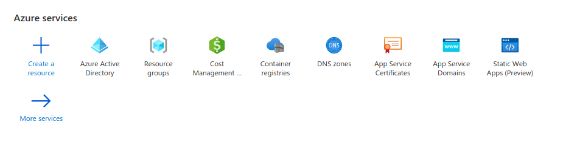
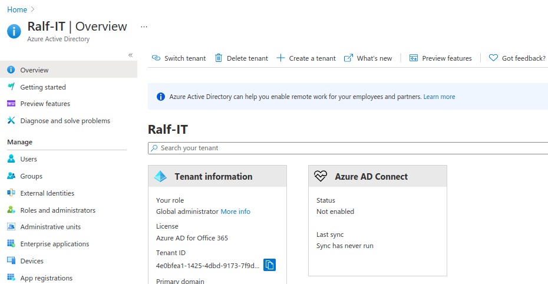
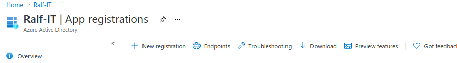
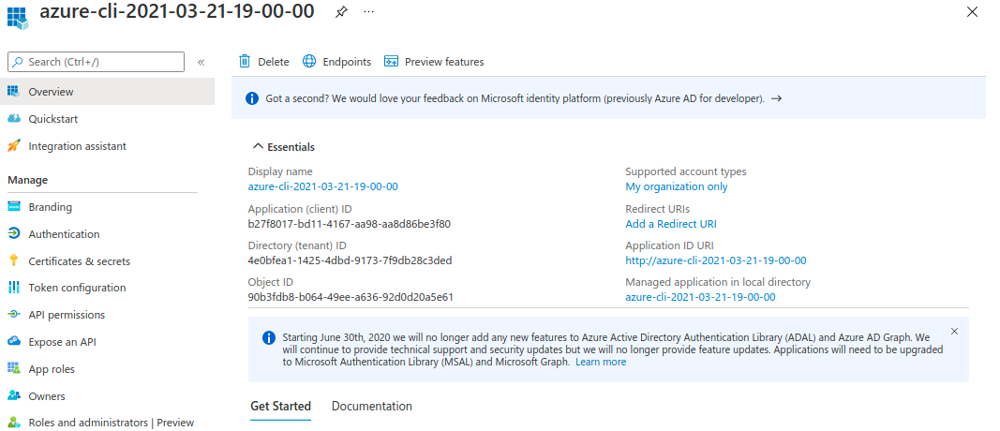
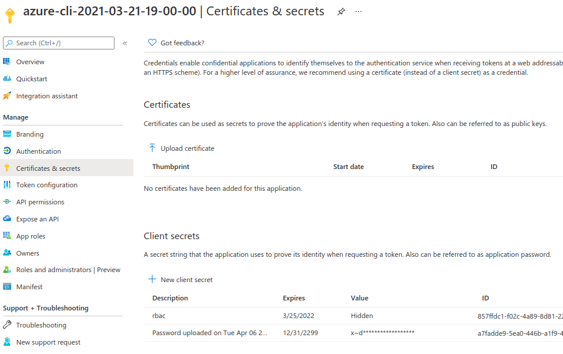
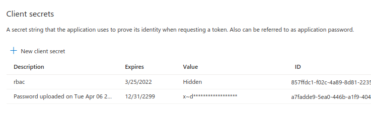
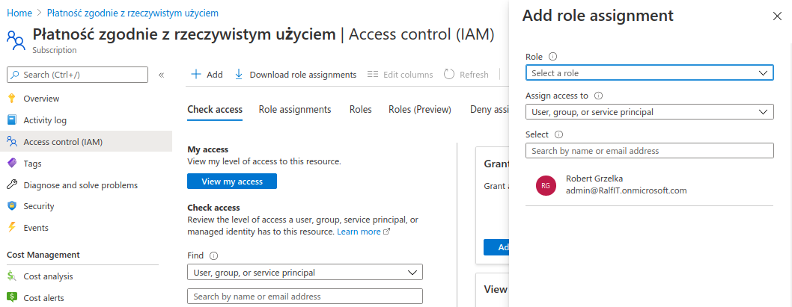
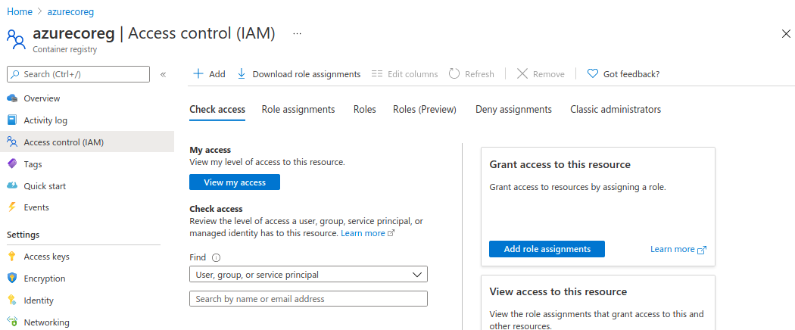
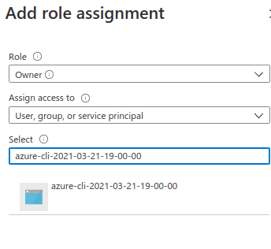

## Setup service principal for whole subscription

### >>> Via Azure (Portal) Shell

[Authenticate with service principal - Azure Container Registry](https://docs.microsoft.com/en-us/azure/container-registry/container-registry-auth-service-principal)

```sh

SERVICE_PRINCIPAL_NAME=<service-principal>

AAD_SECRET=$(az ad sp create-for-rbac --name http://$SERVICE_PRINCIPAL_NAME --scopes $ACR_REGISTRY_ID --role acrpull --query password --output tsv)
AAD_CLIENT_ID=$(az ad sp show --id http://$SERVICE_PRINCIPAL_NAME --query appId --output tsv)
ADD_TENANT_ID=$(az ad sp show --id http://$SERVICE_PRINCIPAL_NAME --query tenantId --output tsv)

# Output the service principal's credentials; use these in your services and
# applications to authenticate to the container registry.
echo "Service principal ID: $SP_APP_ID"
echo "Service principal password: $SP_PASSWD"
```


### >>> Via Azure Portal

#### >>> Go to AAD
<div style="background-color: black; text-align: center; padding-top: 20px; padding-right: 20px; padding-bottom: 5px; padding-left: 20px;">



</div>

#### >>> App Registrations
<div style="background-color: black; text-align: center; padding-top: 20px; padding-right: 20px; padding-bottom: 5px; padding-left: 20px;">



</div>

#### >>> new registration -> ...
<div style="background-color: black; text-align: center; padding-top: 20px; padding-right: 20px; padding-bottom: 5px; padding-left: 20px;">



</div>

#### >>> Grab `AAD_CLIENT_ID` and `ADD_TENANT_ID`
<div style="background-color: black; text-align: center; padding-top: 20px; padding-right: 20px; padding-bottom: 5px; padding-left: 20px;">



</div>

#### >>> Create secret and save as `AAD_SECRET`
<div style="background-color: black; text-align: center; padding-top: 20px; padding-right: 20px; padding-bottom: 5px; padding-left: 20px;">



</div>
<br>
<div style="background-color: black; text-align: center; padding-top: 20px; padding-right: 20px; padding-bottom: 5px; padding-left: 20px;">



</div>

#### >>> Assign role to subscription to controll all resources in subscription:

<div style="background-color: black; text-align: center; padding-top: 20px; padding-right: 20px; padding-bottom: 5px; padding-left: 20px;">



</div>

#### >>> Or assing role to Container Registry to controll only it:

<div style="background-color: black; text-align: center; padding-top: 20px; padding-right: 20px; padding-bottom: 5px; padding-left: 20px;">



</div>

#### >>> Here set service principal as Owner

<div style="background-color: black; text-align: center; padding-top: 20px; padding-right: 20px; padding-bottom: 5px; padding-left: 20px;">



</div>

