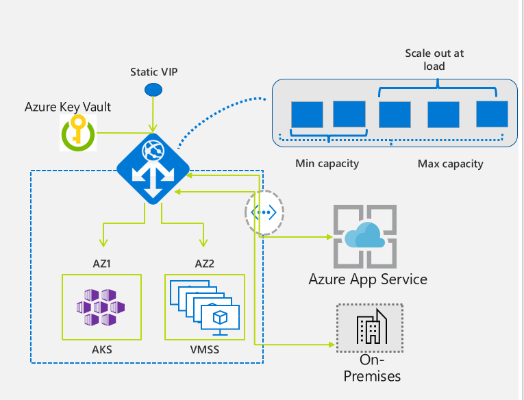

# References

[Application Gateway high traffic volume support](https://docs.microsoft.com/en-us/azure/application-gateway/high-traffic-support)

# Features

[Azure Application Gateway features](https://docs.microsoft.com/en-us/azure/application-gateway/features)

# Routing

## Multiple site hosting with Backend Pools

Multiple site hosting enables you to configure more than one web application on the same port of an application gateway. It allows you to configure a more efficient topology for your deployments by adding up to **100+ websites** to one application gateway. Each website can be directed to its own backend pool. For example, three domains, contoso.com, fabrikam.com, and adatum.com, point to the IP address of the application gateway. You'd create three multi-site listeners and configure each listener for the respective port and protocol setting.

>  **Important**
> 
> Rules are processed in the order they are listed in the portal for the v1 SKU. For the v2 SKU, exact matches have higher precedence. It is highly recommended to configure multi-site listeners first prior to configuring a basic listener. This will ensure that traffic gets routed to the right back end. If a basic listener is listed first and matches an incoming request, it gets processed by that listener.

# AAG Standard V2 compared to Standard V1

[Autoscaling and Zone-redundant Application Gateway v2](https://docs.microsoft.com/en-us/azure/application-gateway/application-gateway-autoscaling-zone-redundant#feature-comparison-between-v1-sku-and-v2-sku)

The new v2 SKU includes the following enhancements:

- Autoscaling
- Zone redundancy
- Static VIP (Public IP)
- Header Rewrite 
- Key Vault Integration
- Azure Kubernetes Service Ingress Controller
- Performance enhancements
- Faster deployment and update time

Feature comparison between v1 SKU and v2 SKU

| Feature                                                               | v1 SKU | v2 SKU |
|-----------------------------------------------------------------------|--------|--------|
| Autoscaling                                                           |        | ✓      |
| Zone redundancy                                                       |        | ✓      |
| Static VIP                                                            |        | ✓      |
| Azure Kubernetes Service (AKS) Ingress controller                     |        | ✓      |
| Azure Key Vault integration                                           |        | ✓      |
| Rewrite HTTP(S) headers                                               |        | ✓      |
| URL-based routing                                                     | ✓      | ✓      |
| Multiple-site hosting                                                 | ✓      | ✓      |
| Traffic redirection                                                   | ✓      | ✓      |
| Web Application Firewall (WAF)                                        | ✓      | ✓      |
| WAF custom rules                                                      |        | ✓      |
| Transport Layer Security (TLS)/Secure Sockets Layer (SSL) termination | ✓      | ✓      |
| End-to-end TLS encryption                                             | ✓      | ✓      |
| Session affinity                                                      | ✓      | ✓      |
| Custom error pages                                                    | ✓      | ✓      |
| WebSocket support                                                     | ✓      | ✓      |
| HTTP/2 support                                                        | ✓      | ✓      |
| Connection draining                                                   | ✓      | ✓      |

## Static VIP (Public IP) 

 There isn't a static VIP in v1, so you must use the application gateway URL instead of the IP address for domain name routing to App Services via the application gateway.

# Sizing

Application Gateway Standard_v2 can be configured for autoscaling or fixed size deployments. The v2 SKU doesn't offer different instance sizes. For more information on v2 performance and pricing, see Autoscaling V2 and Understanding pricing.

The Application Gateway Standard (v1) is offered in three sizes: Small, Medium, and Large. Small instance sizes are intended for development and testing scenarios.

For a complete list of application gateway limits, see Application Gateway service limits.

The following table shows an average performance throughput for each **application gateway v1** instance with SSL offload enabled:

## AAG Standard Throughtput

| Average back-end page response size | Small    | Medium   | Large    |
|-------------------------------------|----------|----------|----------|
| 6 KB                                | 7.5 Mbps | 13 Mbps  | 50 Mbps  |
| 100 KB                              | 35 Mbps  | 100 Mbps | 200 Mbps |

> These values are approximate values for an application gateway throughput. The actual throughput depends on various environment details, such as average page size, location of back-end instances, and processing time to serve a page. For exact performance numbers, you should run your own tests. These values are only provided for capacity planning guidance.

## AAG pricing

### AAG Basic (Standard), Large, 1 instance, 200MBps ~ 65.7 TB per month, ?? persistent connections

One instance with throughtput 200 Mbps allow in theory to process 25MBps of data. Per month its 65.7 TB of data. Number of persistent connections ???.

### AAG Standard_v2, 9 instances (90 compute units), 200MBps ~ 65.7 TB per month, 90 x 2500 persistent connections

9 instances (90 computing units) with throughtput 200 Mbps allow in theory to process 25MBps of data. Per month its 65.7 TB of data. Number of possible persistent connections 90 x 2500.

> Each capacity unit is composed of at most: 1 compute unit, or 2,500 persistent connections, or 2.22-Mbps throughput. If any one of these metrics are exceeded, then another n capacity unit(s) are necessary, even if the other two metrics don’t exceed this single capacity unit’s limits.

## AAG throughtput

[How to find the performance of an Azure Application Gateway &#8211; Azure Tips not Found at Docs](http://rudnei.com/index.php/2020/01/06/how-to-find-the-performance-of-an-azure-application-gateway/#:~:text=For%20Application%20Gateway%20v2%3A&text=Each%20capacity%20unit%20is%20composed,support%20approximately%2010%20capacity%20units.)

## AAG Standard case with 32 instances: 6400 Mbps ~ $7500

In the v1 you can reach up to 32 instances (instance here means VM). So, you can consider that each size small, medium and large, are VMs of different cpu/mem capacities.

So, nominally you can get: 32 (instances) * 200 (Mbps) = **6400** Mbps (considering a 100KB page)

## AAG Standard case with 32 instances: 2775 Mbps ~ $3270

In the v1 you can reach up to 32 instances (instance here means VM). So, you can consider that each size small, medium and large, are VMs of different cpu/mem capacities.

So, nominally you can get: 14 (instances) * 200 (Mbps) ~ **2775** Mbps (considering a 100KB page)

## AAG Standard_v2 case with 125 instances: 2775 Mbps ~ $7500

App GW v2 is measured by Capacity Units. (it doesn’t have the concept of small, medium and large as in V1)

Each capacity unit is composed of at most: 1 compute unit, or 2500 persistent connections, or 2.22-Mbps throughput.

Each App GW is capable to reach up to 125 instances.

Each instance can currently support approximately 10 capacity units.

So, nominally you can reach: 125 (instances) * 10 (cap units) * 2.22 (Mbps throughput per cap unit) = **2775** Mbps

# Application Gateway limits

[Azure subscription limits and quotas - Azure Resource Manager](https://docs.microsoft.com/en-us/azure/azure-resource-manager/management/azure-subscription-service-limits?toc=/azure/application-gateway/toc.json#application-gateway-limits)

The following table applies to v1, v2, Standard, and WAF SKUs unless otherwise stated.

| Resource | Limit | Note |
|-|-|-|
| Azure Application Gateway | 1,000 per subscription |  |
| Front-end IP configurations | 2 | 1 public and 1 private |
| Front-end ports | 100 |  |
| Back-end address pools | 100 |  |
| Back-end servers per pool | 1,200 |  |
| HTTP listeners | 200 | Limited to 100 active listeners that are routing traffic. Active listeners = total number of listeners - listeners not active. If a default configuration inside a routing rule is set to route traffic (for example, it has a listener, a backend pool, and HTTP settings) then that also counts as a listener. |
| HTTP load-balancing rules | 100 |  |
| Back-end HTTP settings | 100 |  |
| Instances per gateway | V1 SKU - 32 V2 SKU - 125 |  |
| SSL certificates | 100 | 1 per HTTP listener |
| Maximum SSL certificate size | V1 SKU - 10 KB V2 SKU - 16 KB |  |
| Authentication certificates | 100 |  |
| Trusted root certificates | 100 |  |
| Request timeout minimum | 1 second |  |
| Request timeout maximum | 24 hours |  |
| Number of sites | 100 | 1 per HTTP listener |
| URL maps per listener | 1 |  |
| Maximum path-based rules per URL map | 100 |  |
| Redirect configurations | 100 |  |
| Number of rewrite rule sets | 400 |  |
| Number of Header or URL configuration per rewrite rule set | 40 |  |
| Number of conditions per rewrite rule set | 40 |  |
| Concurrent WebSocket connections | Medium gateways 20k2 Large gateways 50k2 |  |
| Maximum URL length | 32KB |  |
| Maximum header size for HTTP/2 | 4KB |  |
| Maximum file upload size, Standard | 2 GB |  |
| Maximum file upload size WAF | V1 Medium WAF gateways, 100 MB V1 Large WAF gateways, 500 MB V2 WAF, 750 MB |  |
| WAF body size limit, without files | 128 KB |  |
| Maximum WAF custom rules | 100 |  |